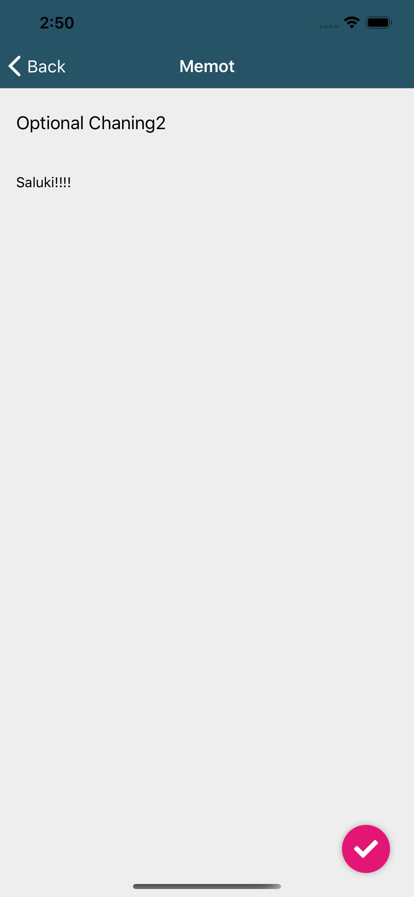

#

# React Native based sample Momo App with TypeScript and Firebase

This is an sample memo app that developed by Facebook react native and Expo.

You can use this app with your Googel Firebase Account!

## App Screen

|Login|Memo List|
|---|---|
|||

|Detail|Edit|
|---|---|
|||

## Usage

1. Make the enviroment to use React Native. Need to install specific version like below.

```
$ node -v 
v10.19.0

$ npm -v 
6.13.4

$ npm install -g expo-cli
```

2. Set up your Google Firebase Console. Follow the [official documentation](https://firebase.google.com/docs/web/setup).

3. Create `env.json` from `env.json.sample` and set your credential information to it.

```
  "FIREBASE_API_KEY": "",
  "FIREBASE_AUTH_DOMAIN": "",
  "FIREBASE_DATABASE_URL": "",
  "FIREBASE_PROJECT_ID": "",
  "FIREBASE_STORAGE_BUCKET": "",
  "FIREBASE_MESSAGING_SENDER_ID": "",
  "FIREBASE_APP_ID": "",
  "FIREBASE_MEASUREMENT_ID": ""
```

4. Get npm module and run!

```
$ npm install

$ expo r -c
```

## Reference
[React Native で iOS / Android アプリ開発をゼロから始めよう！](https://www.udemy.com/course/react-native-ios-android/)